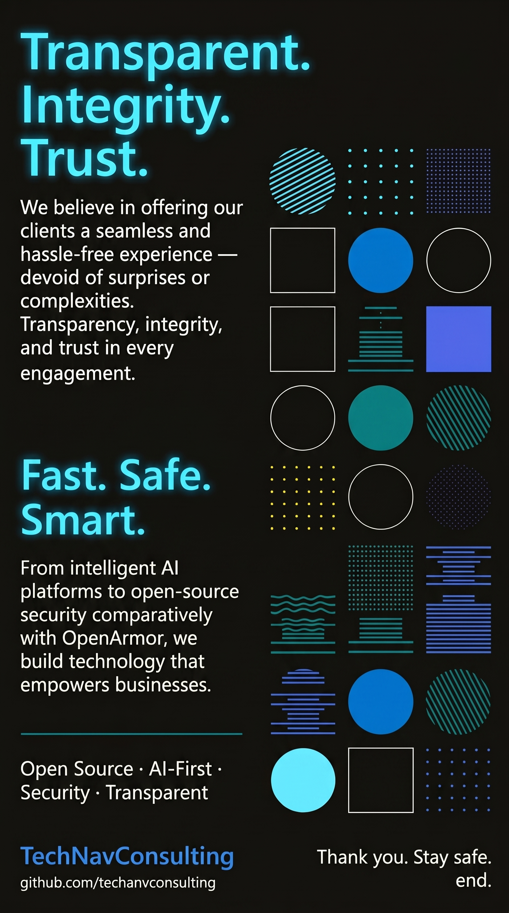

  

 

# Techanv Consulting

**Open Source &nbsp;·&nbsp; AI-First &nbsp;·&nbsp; Security &nbsp;·&nbsp; Transparent**

---

We build technology that empowers businesses — fast, safe, and smart. From cybersecurity architecture to intelligent AI platforms, every engagement is grounded in transparency, integrity, and trust.

### What We Do

| Domain | Services |
|--------|----------|
| **Cybersecurity** | Threat detection · Network security · Web app security · Risk assessment |
| **AI Platforms** | Open-source AI tooling · Secure integrations · Production-grade deployments |
| **Consulting** | Architecture review · Data protection · Secure Wi-Fi · Compliance advisory |

---

**Certified professionals. Global reach. 24/7 support.**

[contact@techanv.com](mailto:contact@techanv.com) &nbsp;·&nbsp; Vadodara, Gujarat, India

© 2025 Techanv Consulting. All Rights Reserved.

